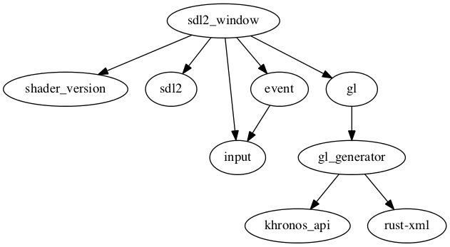

# sdl2_window [](https://travis-ci.org/PistonDevelopers/sdl2_window)

An SDL2 back-end for the Piston game engine

Maintainers: @TyOverby, @bvssvni, @Coeuvre

[How to contribute](https://github.com/PistonDevelopers/piston/blob/master/CONTRIBUTING.md)


# Installation
 To use this as a dependency, add the following code to your Cargo.toml file:

```rust
    [dependencies.pistoncore-sdl2_window]
    git = "https://github.com/PistonDevelopers/sdl2_window"
```


### How to create a window

```Rust
let mut window = Sdl2Window::new(
    shader_version::opengl::OpenGL_3_2,
    WindowSettings {
        title: "My application".to_string(),
        size: [640, 480],
        fullscreen: false,
        exit_on_esc: true,
        samples: 4,
    }
);
```

### Troubleshooting

* [I get `ld: library not found for -lSDL2` error on OSX](https://github.com/PistonDevelopers/rust-empty/issues/175)

## Dependencies



